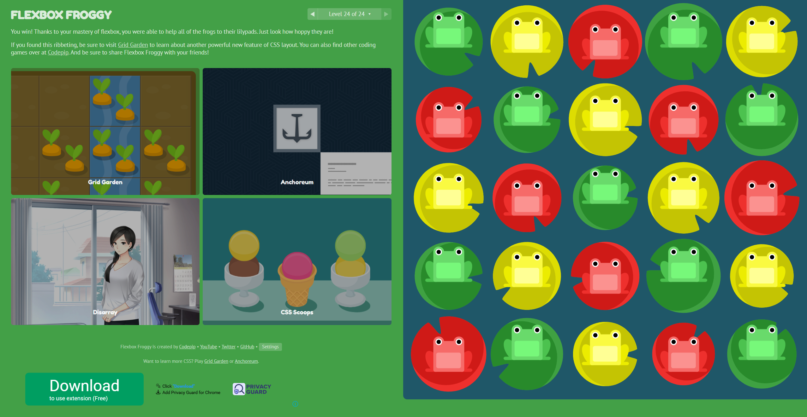
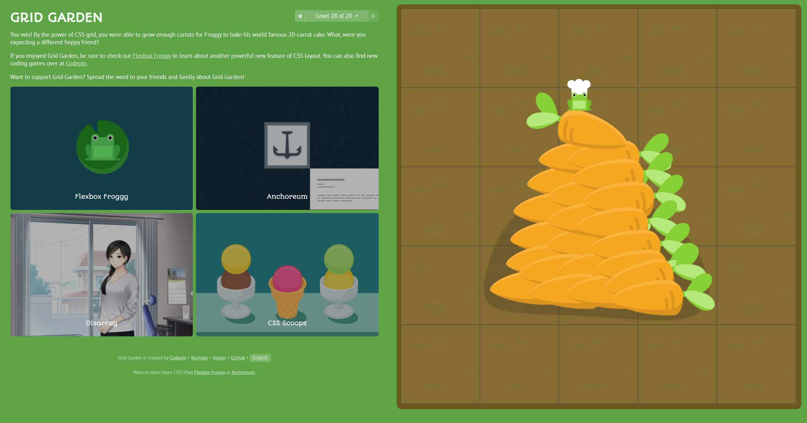

# is120-hw6-hamidjaeyoung-jahangir

LIVE LINK: https://hamidjae.github.io/is120-hw6-hamidjaeyoung-jahangir/

## Flexbox Froggy Completion

## Grid Garden Completion

## Flexbox vs.  Grid
SURVEY COMPLETED

The difference between Flexbox and Grid comes down to how best to use them depending on what you're structuring. Flexbox is content-based, and is best used when aligning content on a one-dimensional layout, such as when assigning menu options in a navbar, or stacking cards ontop of or next to each other. 

Grid on the other hand is structure-based, and is best used when aligning content on a two-dimensional layout. The best example I can give is the assignment I have completed just now: technically you COULD use Flexbox to assign the navbar, footer, menu, aside and main. However, Grid is simply more easier to use on this particular type of structure because it is simply more natural to use a 2D framework rather than two 1D frameworks.

To put it simply, the difference between Flexbox and Grid is that Grid is 2 dimensional, while Flexbox is 1 dimensional. Their use cases naturally reflect this, as Grid is better for page layouts, while Flexbox is better for item layout.

I like to use Grid more, simply because I find that using Grid to allocate the space we want for a webpage is far easier than using Flexbox to do so. Grid is simply more intuitive for me, and I feel that I can often get a little bit lost using Flexbox for page layouts. Once page layouts are established, everything else becomes much more simpler to handle.

## Responsive Design

I added two media queries at 900px and 600px. The 900px media query changes the body so that it becomes one column instead of two, and transforms the sidebar from a vertical column to a horizontal row that automatically wraps in responsive to different sizes within the media query threshold. Meanwhile, the 600px media query allows the navbar to wrap, and transforms the cards to become more dynamic in response to resizing, going from 300px fixed.

The Bootstrap standard breakpoints for small sizes is 576px, with Tailwind having it at 640px. My breakpoint is at 600px instead. For Bootstrap, large size is at 992px while Tailwind has it at 1024px. My breakpoint is at 900px instead.
I would say that for small sizes, I have quite similar breakpoints (I chose 600 because it was a nicer, rounder number) but I am at least 92 pixels away from the large size.

If I had to redesign this web page, I would have removed the fixed heights on cards. These fixed heights actually caused problems in my responsive design, because the navbar was overflowing until I adjusted the fixed height of the navbar to allow it to be more dynamic. I also think I would have wrapped my nav, body, and footer to make it more easier to slap responsive designs onto it.
